# ⚡️ MyRpg
**Epitech Project, 2021 | 1st Year (PGE)**
## 🔍 Description
This project is one of the freest project of your first year, the creation of your own RPG. The subject is available [here](./B-MUL-200_my_rpg.pdf).

Your game must follow the following rules:
- The player needs to have characteristics which you can find in the status menu.
- The player can fight enemies, statistics will impact the fights results.
- There must be NPC in your game.
- You need to implement at least one quest.
- The player must have an inventory which can contain a limited set of items.
- The player can earn experience by winning fights and accomplishing specific actions.
- With enough experience, the player can level up, upgrading its statistics.

To realize our project, we were only allowed to use some functions.
<p align="center">
    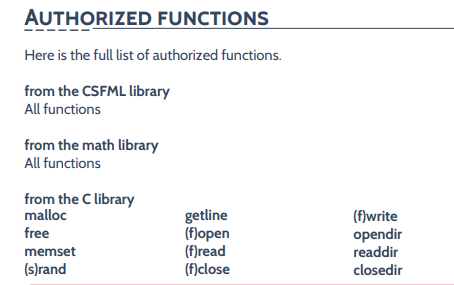
</p>
We started with the creation of a game engine, that is to say that we created functions allowing to add buttons, particle generators, animated texts... as simply as possible to save time later. You just have to call the function and the new object will be stored after the linked list of its type.
<p align="center">
    <br/>
    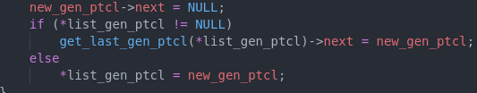
</p>

Another important part, is the creation of a JSON parser and writer.\
We were obviously not allowed to use what already exists, so we remade a [JSON parser](https://github.com/Davphla/JSON-Parser) which you will see will be useful later on.

[](https://github.com/Davphla/JSON-Parser)

Then, after preparing our game engine, we made a scene system that fades at each scene change, then we focused on the menu, a smooth interface, intuitive, buttons that have pixel accurate hitboxes.
<p align="center">
    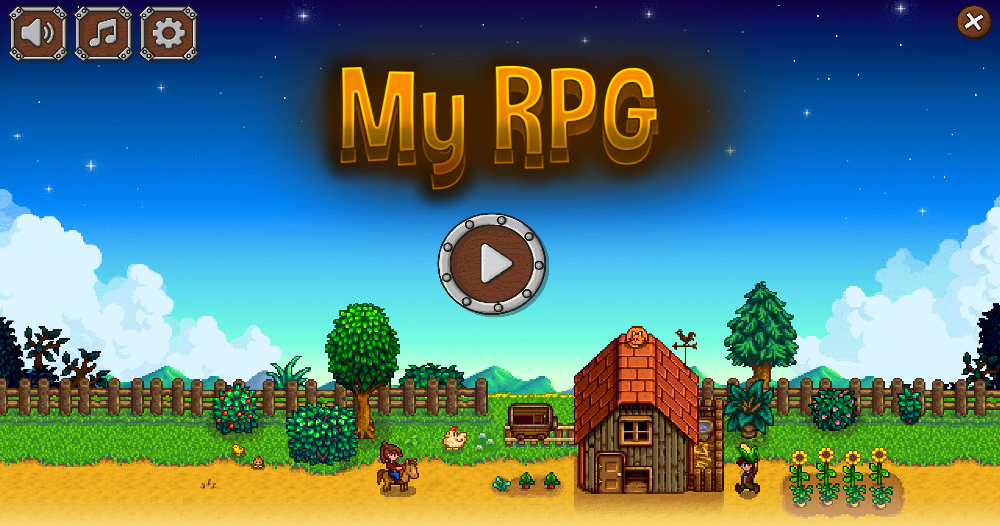
</p>
It was also important to create a menu setting. We decided to program sliders for the sound, buttons for frames per second, and for full screen settings.
<p align="center">
    <br/>
    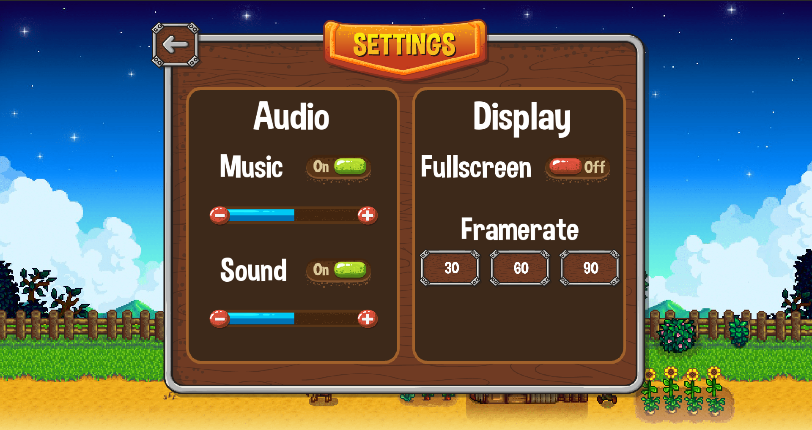
</p>
After that we have the different saves, the game can manage up to 3 different saves, if you create a new game you will have the choice between 4 different skins, which does not change anything to the gameplay.

The saves are saved in a JSON format.
<p align="center">
    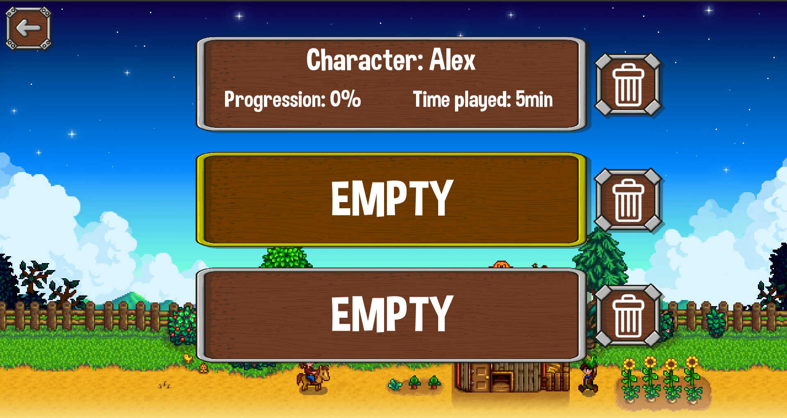
</p>
Speaking of the json format, here is an example of a map file.
<p align="center">
    <br/>
    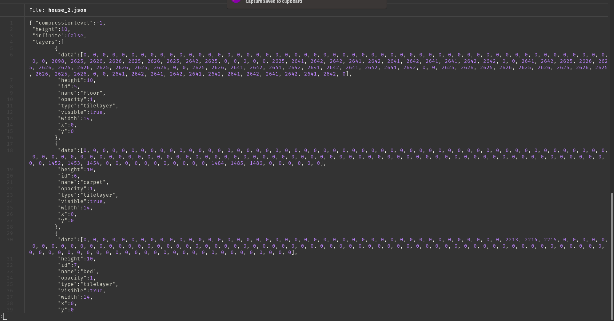
</p>

And speaking of maps, our maps are on five different layers to recreate a 3D effect, including a collision layer to manage the hitbox. The maps were entirely created by ourselves using [Tiled](https://www.mapeditor.org/) software, and then exported to JSON format.
<p align="center">
  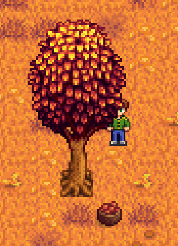
</p>
We also have event management integrated directly into the map files.
<p align="center">
    <br/>
    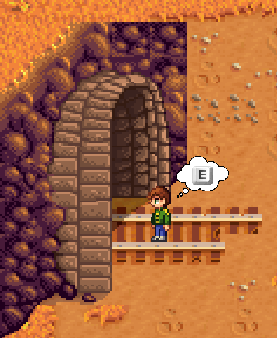
</p>
It is also possible to talk to NPC's, which move according to patterns. They stop when they detect you near them, you can talk to them, then animated texts are displayed, the facial expressions change according to the dialogues.
<p align="center">
    <br/>
    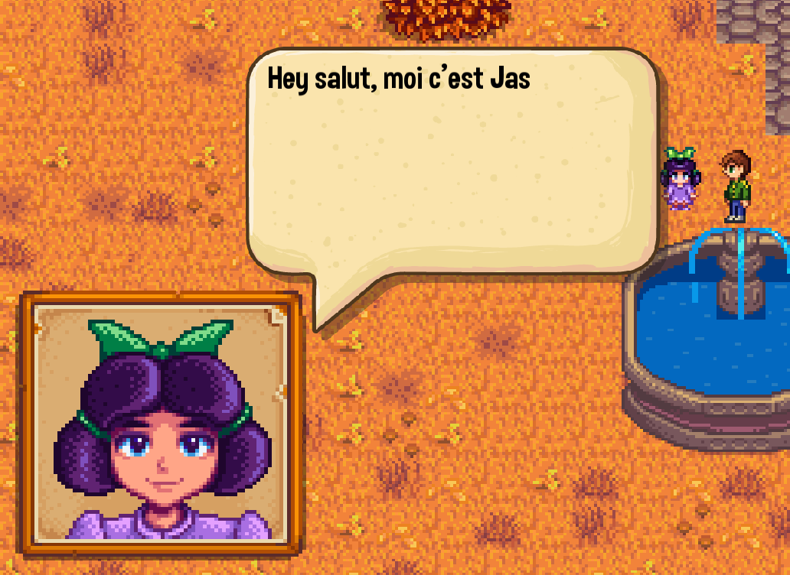
</p>
Moreover, talking to the NPC allows you to unlock quests. Dialogues, events, accessible zones evolve according to the quests and the player's progress.
<p align="center">
    <br/>
    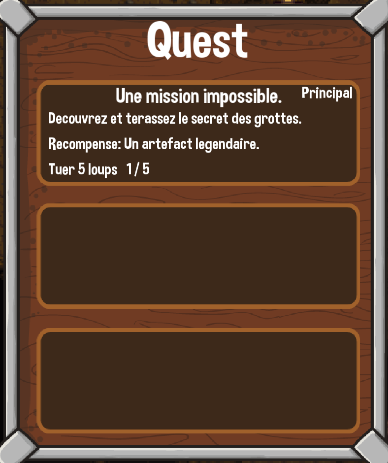
</p>
In some areas it is possible to be attacked by monsters, the fight takes place in two phases. A first phase of attack where you have to press the space key at the right moment, the bar moves thanks to a sinusoidal function.
<p align="center">
    <br/>
    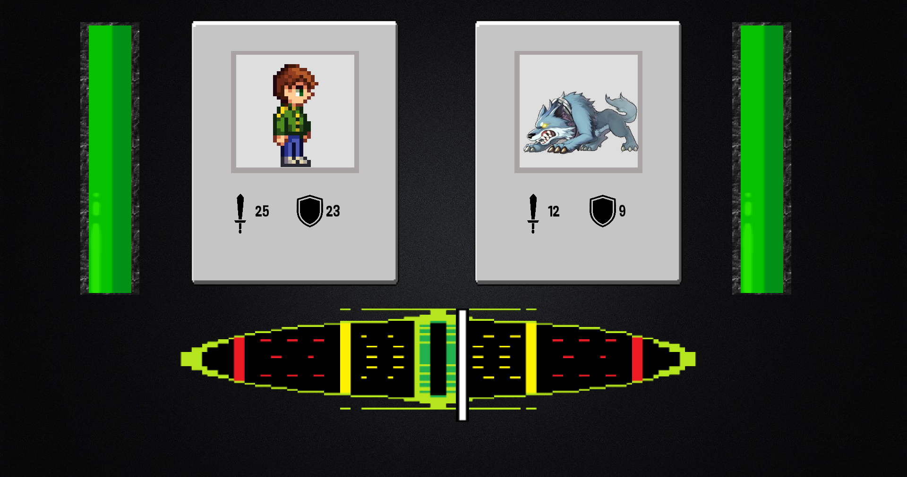
</p>
Then the defense part is a "Hell bullet", you are the blue ball and you have to dodge the red balls that are generated by 4 particle generators on the edges that are moving to avoid blind spots. Moreover the statistics of the monsters (level, attack) define the number, the speed, and the damages of the red balls.
<p align="center">
    <br/>
    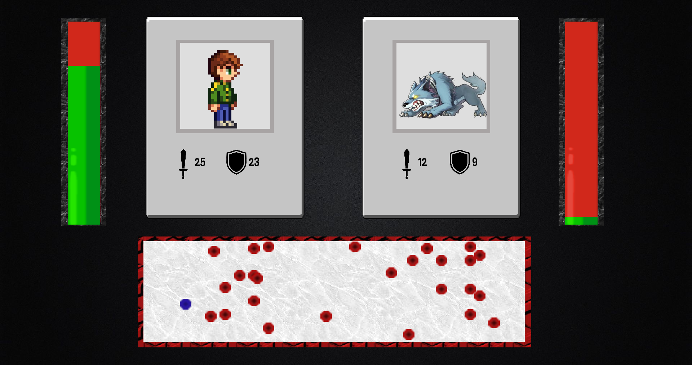
</p>
Fighting monsters gives you experience and items, some events also give you items. All of this is directly manageable from an inventory that handles drag & drop or double click to equip/use an item. It is also possible to throw an item out of the inventory by drag & drop to delete it permanently.
<p align="center">
    <br/>
    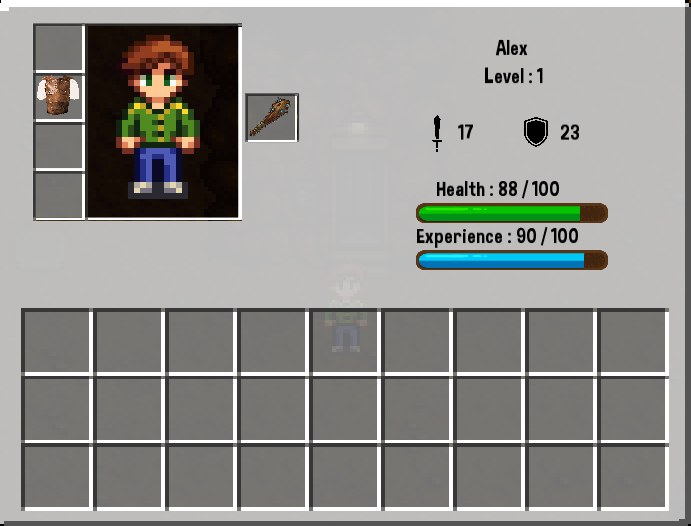
</p>
By the way, in terms of experience, each time you pass a level you unlock a star that allows you to improve your skill tree. Each upgrade unlocks another one, several paths are possible, will you choose attack, defense or speed in priority ?
<p align="center">
    <br/>
    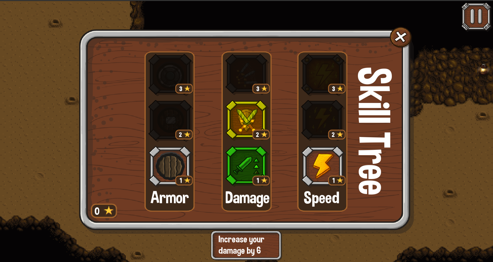
</p>
To finish this description, here is the in-game menu, with the possibility to save, to go back to the menu, to quit the game, to open a minimalist in-game settings menu, or just to resume the game.
<p align="center">
    <br/>
    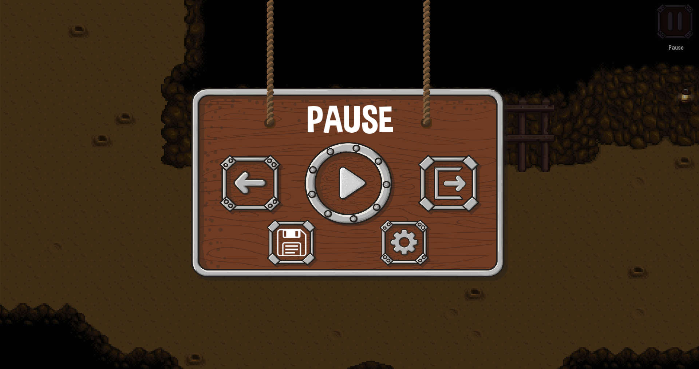
</p>

#
## ⚙️ Installation
⚠️ This project requires CSFML 2.5.0 to build.
```
git clone https://github.com/MaximePremont/zappy_epitech.git
cd zappy_epitech
pip3 install -r requirements.txt
make
```
#
## 📝 Start project
```
./my_rpg
```
#
## ❤️ Contributors
&nbsp;&nbsp;&nbsp;&nbsp;&nbsp;&nbsp; 📌 [PREMONT Maxime](https://github.com/MaximePremont)  
&nbsp;&nbsp;&nbsp;&nbsp;&nbsp;&nbsp; 📌 [VALLENET Mikael](https://github.com/Mikatech)  
&nbsp;&nbsp;&nbsp;&nbsp;&nbsp;&nbsp; 📌 [SABRE Nolann](https://github.com/Nolann71)  
&nbsp;&nbsp;&nbsp;&nbsp;&nbsp;&nbsp; 📌 [GOZLAN David](https://github.com/Davphla)

Special thanks to [VALLENET Mikael](https://github.com/Mikatech) who allowed the use of [his readme](https://github.com/Mikatech/my_rpg/blob/main/README.md) to write this one.